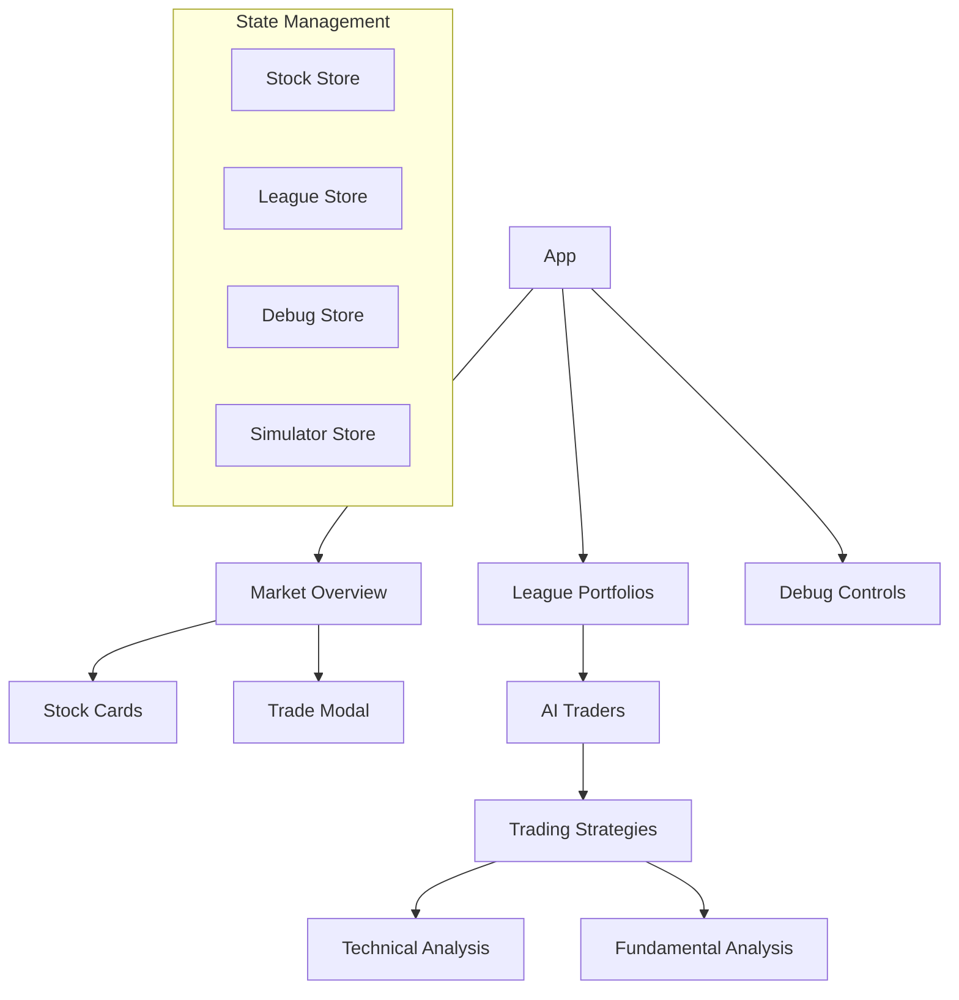
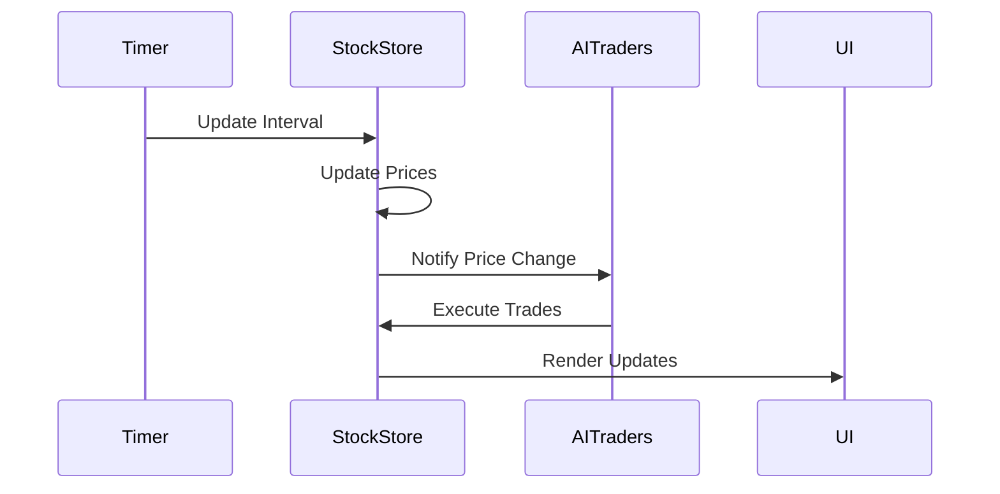
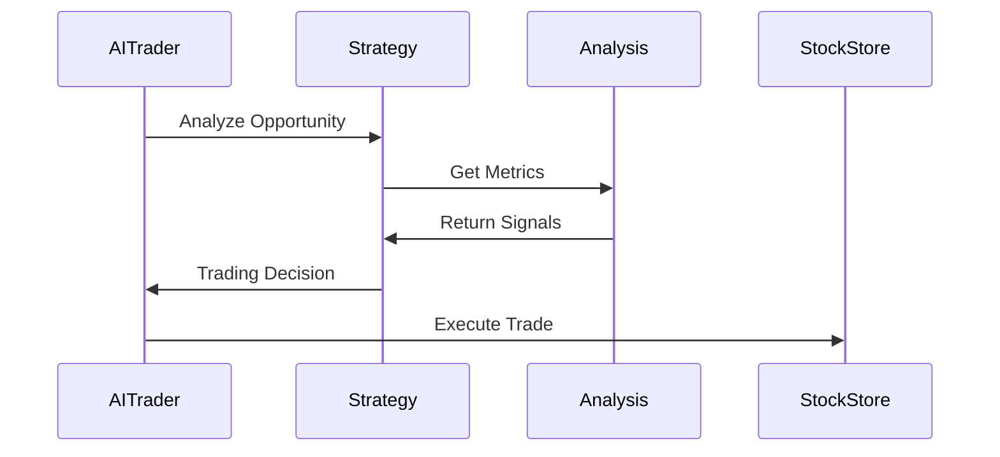

# Stock Market Simulator

A real-time stock market simulator with AI traders and portfolio management.

## Architecture Overview



## Core Components

### State Management

The application uses Zustand for state management with four main stores:

1. **Stock Store** (`stockStore.ts`)
    - Manages stock data and market state
    - Handles real-time price updates
    - Processes trade executions
   ```typescript
   interface StockState {
     stocks: Stock[];
     portfolio: Portfolio;
     walletBalance: number;
     transactions: Transaction[];
     updateInterval: number;
   }
   ```

2. **League Store** (`leagueStore.ts`)
    - Manages AI trader portfolios
    - Tracks league performance
   ```typescript
   interface LeagueState {
     members: LeagueMember[];
     updateMemberPortfolios: () => void;
   }
   ```

3. **Debug Store** (`debugStore.ts`)
    - Controls simulation debugging
    - Manages pause/resume functionality
   ```typescript
   interface DebugState {
     isDebugMode: boolean;
     isPaused: boolean;
     toggleDebugMode: () => void;
     togglePause: () => void;
   }
   ```

### Trading System

#### Strategy Pattern Implementation

```typescript
abstract class BaseStrategy {
  protected maxPositionSize: number;
  protected minStockPrice: number;
  
  abstract analyze(
    stock: Stock,
    portfolioValue: number,
    currentHoldings: number
  ): TradingDecision;
}
```

Available strategies:
- Value Strategy: Based on fundamental analysis
- Momentum Strategy: Based on technical analysis

#### Analysis Tools

1. **Technical Analysis** (`technical.ts`)
    - RSI (Relative Strength Index)
    - MACD (Moving Average Convergence Divergence)
   ```typescript
   interface MomentumSignals {
     strongBuy: boolean;
     strongSell: boolean;
     rsi: number;
     macdSignal: 'buy' | 'sell' | 'neutral';
   }
   ```

2. **Fundamental Analysis** (`fundamentals.ts`)
    - P/E Ratio
    - Price-to-Book Ratio
   ```typescript
   interface ValueMetrics {
     isUndervalued: boolean;
     isOvervalued: boolean;
     peRatio: number;
     priceToBook: number;
   }
   ```

### AI Trading System

The `AITrader` class manages autonomous trading:

```typescript
class AITrader {
  private strategy: BaseStrategy;
  private portfolioValue: number;
  private cash: number;
  private holdings: Map<string, number>;
  
  public analyzeTradingOpportunity(stock: Stock): TradingDecision;
  public executeTrade(decision: TradingDecision, stock: Stock): TradeExecution;
}
```

Trading Constraints:
- Maximum position size: 10% of portfolio
- Minimum stock price: $5
- Initial capital: $100,000

## Debug System

The debug system provides:
1. Real-time state inspection
2. Pause/Resume functionality
3. Step-by-step execution
4. Current state visualization

Implementation using custom hook:
```typescript
function useDebugInterval(callback: () => void, delay: number) {
  const { isPaused } = useDebugStore();
  // ... interval logic
}
```

## Data Flow

1. **Price Updates**


2. **Trading Flow**


## Type Definitions

Key interfaces that define the system:

```typescript
interface Stock {
  id: string;
  name: string;
  symbol: string;
  price: number;
  previousPrice: number;
  availableShares: number;
  priceHistory: number[];
  news: NewsItem[];
}

interface TradingDecision {
  action: 'buy' | 'sell' | 'hold';
  quantity?: number;
  reason: string;
}

interface LeagueMember {
  id: string;
  username: string;
  algorithm: 'Conservative' | 'Aggressive' | 'Random';
  portfolioValue: number;
  holdings: MemberHolding[];
}
```

## Getting Started

1. Clone the repository
2. Install dependencies: `npm install`
3. Start development server: `npm run dev`
4. Access debug mode: Click the bug icon in bottom-right corner

## Development Guidelines

1. **Adding New Strategies**
    - Extend `BaseStrategy`
    - Implement `analyze` method
    - Register in `AITrader`

2. **Custom Analysis Tools**
    - Add to `technical.ts` or `fundamentals.ts`
    - Update relevant strategy classes

3. **State Management**
    - Use appropriate store for related state
    - Maintain immutability
    - Follow Zustand patterns