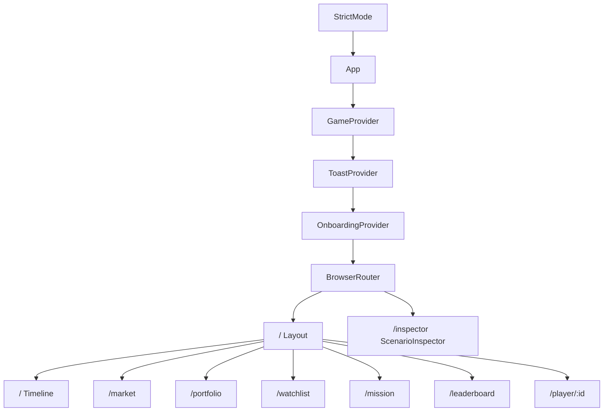
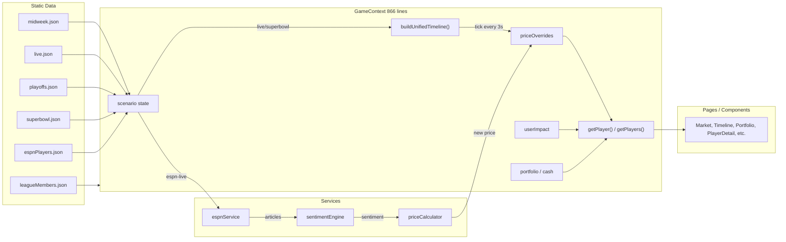

# McQueen POC Audit — Research Artifact

> **Issue**: mcq-qvk · Research: Understand Current POC Behavior
> **Blocks**: mcq-7h6 (Spec: Write Refactor Specification)
> **Date**: 2026-02-16

---

## 1. User Flows

### 1.1 Timeline (Home — `/`)

The default landing page. Presents a reverse-chronological feed of every price-moving event across all players in the current scenario.

| Step         | Interaction                                       | Outcome                                                             |
| ------------ | ------------------------------------------------- | ------------------------------------------------------------------- |
| Browse       | Scroll the event feed                             | See timestamp, player badge, event type, headline, price, change %  |
| Filter       | Type dropdown (all / news / trades / game events) | Narrows visible events                                              |
| Filter       | Magnitude slider (all / >2% / >5%)                | Shows only significant moves                                        |
| Filter       | Time dropdown (all / today / this week)           | Restricts time window                                               |
| Search       | Text input                                        | Filters by player name, team, or headline text                      |
| Expand       | Click event card                                  | Reveals trade widget + content links                                |
| Trade inline | Set quantity, click Buy/Sell                      | Executes trade via `buyShares()`/`sellShares()`, toast confirmation |
| Navigate     | Click player badge                                | Routes to `/player/:playerId`                                       |

**Context consumed**: `getPlayers()`, `getPlayer()`, `cash`, `buyShares()`, `sellShares()`, `portfolio`

**Key detail**: Timeline is constructed by merging every player's `priceHistory` array, sorting by timestamp (newest first). Each entry carries the originating player ID.

---

### 1.2 Market (`/market`)

Grid of player cards with search and sorting.

| Step        | Interaction                                                              | Outcome                                              |
| ----------- | ------------------------------------------------------------------------ | ---------------------------------------------------- |
| Browse      | View player card grid                                                    | See headshot, name, team, price, change %, sparkline |
| Sort        | Tab bar (Biggest Risers / Biggest Fallers / Most Active / Highest Price) | Re-orders grid                                       |
| Search      | Text input                                                               | Filters by player name or team                       |
| Navigate    | Click any player card                                                    | Routes to `/player/:playerId`                        |
| Dismiss     | Close welcome banner                                                     | Persisted to localStorage, never shown again         |
| First trade | View FirstTradeGuide tooltip                                             | Shown until first trade is made                      |

**Context consumed**: `getPlayers()`, `currentData`, `scenario`, `portfolio`

**Sidebar**: `<MiniLeaderboard />` shows top 3 traders + user position.

---

### 1.3 Player Detail + Trading (`/player/:playerId`)

Central trading screen with price chart, buy/sell interface, and player context.

| Step          | Interaction                                 | Outcome                                                                                 |
| ------------- | ------------------------------------------- | --------------------------------------------------------------------------------------- |
| View          | Land on page                                | See price chart, current price, change %, move reason                                   |
| Buy           | Select shares → "Buy X Shares"              | `buyShares()` called, cash deducted, portfolio updated, +0.1%/share price impact, toast |
| Sell          | Switch to Sell tab → select shares → "Sell" | `sellShares()` called, cash added, portfolio updated, -0.1%/share price impact, toast   |
| Watchlist     | Click heart icon                            | `addToWatchlist()` / `removeFromWatchlist()`, toast                                     |
| Chart         | Click event marker on chart                 | `<EventMarkerPopup />` shows headline, price, source link                               |
| Content       | Scroll to content tiles                     | News articles, videos, analysis links                                                   |
| League        | View "Who Owns This" section                | Shows league member holdings                                                            |
| Navigate back | Click back button                           | `navigate(-1)`                                                                          |

**Context consumed**: `getPlayer()`, `portfolio`, `buyShares()`, `sellShares()`, `addToWatchlist()`, `removeFromWatchlist()`, `isWatching()`, `getLeagueHoldings()`

**Key detail**: Price impact formula is `basePrice * (1 + userImpact)` where `userImpact += 0.001 * shares` on buy, `-= 0.001 * shares` on sell.

---

### 1.4 Portfolio (`/portfolio`)

Displays user's holdings and financial summary.

| Step          | Interaction                       | Outcome                                                                 |
| ------------- | --------------------------------- | ----------------------------------------------------------------------- |
| View summary  | See 4 cards                       | Total Value, Cash Available, Invested, Total Gain/Loss                  |
| View holdings | See table rows                    | Player, Shares, Avg Cost, Current Price, Value, Gain/Loss (color-coded) |
| Navigate      | Click holding row                 | Routes to `/player/:playerId`                                           |
| Empty state   | No holdings                       | Shows trending players (top 3 risers) with navigation to Market         |
| Tooltips      | Hover info icons on summary cards | Explains each metric                                                    |

**Context consumed**: `portfolio`, `getPlayer()`, `getPlayers()`, `getPortfolioValue()`, `cash`

**Key detail**: Starting portfolio is loaded from `currentData.startingPortfolio` on scenario change — user begins with pre-seeded positions.

---

### 1.5 Watchlist (`/watchlist`)

Curated list of players the user is tracking.

| Step        | Interaction                   | Outcome                                                                 |
| ----------- | ----------------------------- | ----------------------------------------------------------------------- |
| View        | See watched player cards      | Grid of `<PlayerCard />` components                                     |
| Remove      | Click X on card               | `removeFromWatchlist()`, toast                                          |
| Quick add   | Click "+" on suggested player | `addToWatchlist()`, toast                                               |
| Navigate    | Click card                    | Routes to `/player/:playerId`                                           |
| Empty state | No watched players            | Shows top 4 popular players (by absolute change) with quick-add buttons |
| CTA         | "Browse All Players"          | Routes to `/market`                                                     |

**Context consumed**: `watchlist`, `getPlayer()`, `getPlayers()`, `removeFromWatchlist()`, `addToWatchlist()`

---

### 1.6 Daily Mission (`/mission`)

Prediction mini-game: pick 3 risers and 3 fallers.

| Step         | Interaction                                | Outcome                                               |
| ------------ | ------------------------------------------ | ----------------------------------------------------- |
| Learn        | Toggle "How It Works"                      | Expands help section (localStorage tracks first view) |
| Pick risers  | Click ▲ on up to 3 players                 | Added to risers column                                |
| Pick fallers | Click ▼ on up to 3 players                 | Added to fallers column                               |
| Remove pick  | Click × on pick chip                       | Removed from selection                                |
| Reveal       | Click "Reveal Results!" (requires 6 picks) | Score shown: correct/total + percentile               |
| Play again   | Click "Play Again"                         | Picks cleared, results hidden                         |

**Context consumed**: `getPlayers()`, `missionPicks`, `missionRevealed`, `setMissionPick()`, `clearMissionPick()`, `revealMission()`, `resetMission()`, `getMissionScore()`

**Scoring**: A pick is "correct" if the riser's price went up or the faller's price went down. Percentile = `50 + (correct/total) * 50`.

---

### 1.7 Leaderboard (`/leaderboard`)

Rankings against AI league members.

| Step       | Interaction                         | Outcome                                                          |
| ---------- | ----------------------------------- | ---------------------------------------------------------------- |
| View rank  | See user rank card                  | Current rank, total value, gain %                                |
| View table | See top 10 traders                  | Rank, name, portfolio value, weekly gain (medal icons for top 3) |
| User row   | If rank > 10                        | User's row shown below divider                                   |
| CTA        | "Start Trading →" (empty portfolio) | Routes to `/market`                                              |

**Context consumed**: `cash`, `getPortfolioValue()`, `portfolio`

**Key detail**: Currently uses **hardcoded fake leaderboard data** and injects the user's real value to determine rank. The `getLeaderboardRankings()` function in GameContext exists but is NOT used by this page.

---

### 1.8 Onboarding + Scenario Switching

**Onboarding** (first visit):

1. Modal overlay with 6-step tutorial
2. Progress indicators, back/next navigation
3. Can be skipped via "Skip" button
4. Completion persisted to localStorage — never shown again
5. After onboarding, `<FirstTradeGuide />` appears until first trade

**Scenario Toggle** (header, always visible):

- Desktop: tab bar; Mobile: dropdown
- Options: Midweek, Live Game, Playoffs, Super Bowl, ESPN Live
- Switching resets: `priceOverrides`, `tick`, `userImpact`, `cash` (to $10,000), `portfolio` (to scenario's `startingPortfolio`)
- Live/Super Bowl auto-start playing on selection
- ESPN Live shows refresh button and loading/error states
- Dev mode adds link to `/inspector` (ScenarioInspector)

---

## 2. Architecture & Data Flow

### 2.1 Provider Hierarchy



### 2.2 Data Flow — Scenario to Screen



### 2.3 Price Resolution Pipeline

For any `getPlayer(id)` or `getPlayers()` call, the price is resolved as:

```
1. Check priceOverrides[playerId]          → simulation-driven price
2. Else getCurrentPriceFromHistory(player)  → last priceHistory entry
3. Apply userImpact[playerId]              → basePrice * (1 + impact)
4. Compute changePercent                   → ((current - base) / base) * 100
```

Three sources of truth converge, making price logic hard to reason about.

### 2.4 Simulation Modes

**Mode A — Tick-based (live, superbowl)**:

- `buildUnifiedTimeline(players)` merges all players' `priceHistory` arrays chronologically
- `useEffect` runs a 3-second interval, incrementing `tick`
- Each tick reads `unifiedTimeline[tick]`, writes `priceOverrides[playerId] = entry.price`
- Stops when `tick >= unifiedTimeline.length`

**Mode B — Event-driven (espn-live)**:

- `fetchNFLNews()` called every 60 seconds
- Each article matched to players via `searchTerms`
- `analyzeSentiment(headline)` returns sentiment + magnitude
- `calculateNewPrice(currentPrice, sentiment)` computes new price
- `createPriceHistoryEntry()` formats and appends to `espnPriceHistory[playerId]`
- `priceOverrides` updated with new price

The two modes share no code paths. Different state variables (`unifiedTimeline`/`tick` vs `espnPriceHistory`/`processedArticleIds`), different update mechanisms, different data shapes.

### 2.5 Service Responsibilities

| Service              | Purpose           | Functions                                                                                                                         | Dependencies        |
| -------------------- | ----------------- | --------------------------------------------------------------------------------------------------------------------------------- | ------------------- |
| `espnService.js`     | ESPN API client   | `fetchNFLNews()`, `fetchTeamNews()`, `fetchPlayerNews()`, `fetchScoreboard()`, `clearCache()`, `getCacheStats()`                  | None (native fetch) |
| `sentimentEngine.js` | Keyword-based NLP | `analyzeSentiment()`, `getMagnitudeLevel()`, `getSentimentDescription()`                                                          | None                |
| `priceCalculator.js` | Price impact math | `calculatePriceImpact()`, `applyPriceImpact()`, `calculateNewPrice()`, `calculateCumulativeImpact()`, `createPriceHistoryEntry()` | sentimentEngine     |

### 2.6 Component Context Dependency Map

Components that consume `GameContext` (via `useGame()` hook):

| Component                | State Read                                                      | Functions Called                                                                                                   |
| ------------------------ | --------------------------------------------------------------- | ------------------------------------------------------------------------------------------------------------------ |
| Layout                   | `cash`, `scenario`                                              | `getPortfolioValue()`                                                                                              |
| PlayerCard               | `scenario`, `portfolio`                                         | `isWatching()`, `getLeagueHoldings()`                                                                              |
| MiniLeaderboard          | —                                                               | `getLeaderboardRankings()`                                                                                         |
| ScenarioToggle           | `scenario`, `espnLoading`, `espnError`                          | `setScenario()`, `refreshEspnNews()`                                                                               |
| LiveTicker               | `scenario`, `history`, `tick`, `currentData`, `unifiedTimeline` | —                                                                                                                  |
| TimelineDebugger         | `history`, `tick`, `isPlaying`                                  | `goToHistoryPoint()`, `setIsPlaying()`                                                                             |
| DailyMission             | `missionPicks`, `missionRevealed`                               | `getPlayers()`, `setMissionPick()`, `clearMissionPick()`, `revealMission()`, `resetMission()`, `getMissionScore()` |
| PlayoffAnnouncementModal | `scenario`, `currentData`, `playoffDilutionApplied`             | `applyPlayoffDilution()`                                                                                           |

**Standalone components** (no context): EventMarkerPopup, Glossary, InfoTooltip, SkeletonLoader, FirstTradeGuide, AddEventModal

**Context providers**: Toast (`ToastProvider`/`useToast`), Onboarding (`OnboardingProvider`/`useOnboarding`)

---

## 3. Must-Keep Behaviors

These behaviors are user-facing or structurally load-bearing. They must survive the refactor intact.

### 3.1 Core Simulation

| #   | Behavior              | Detail                                                                                                   |
| --- | --------------------- | -------------------------------------------------------------------------------------------------------- |
| 1   | 4 scenario modes      | Midweek (news-driven), Live (MNF simulation), Playoffs (buyback mechanics), Super Bowl (live simulation) |
| 2   | ESPN Live mode        | Real-time price movement from ESPN API news articles                                                     |
| 3   | Tick-based simulation | 3-second interval advancing through unified timeline for live/superbowl                                  |GFM
| 4   | Scenario switching    | Full state reset (cash, portfolio, overrides, tick) on scenario change                                   |
| 5   | Starting portfolios   | Each scenario seeds the user with pre-defined holdings                                                   |

### 3.2 Trading & Portfolio

| #   | Behavior              | Detail                                                             |
| --- | --------------------- | ------------------------------------------------------------------ |
| 6   | Buy/sell mechanics    | Share-based trading with immediate portfolio + cash updates        |
| 7   | User price impact     | ±0.1% per share traded, applied as multiplier on base price        |
| 8   | Portfolio persistence | `portfolio`, `watchlist`, `cash`, `scenario` saved to localStorage |
| 9   | Portfolio summary     | Total value, cash, invested, gain/loss calculations                |
| 10  | Inline trading        | Buy/sell from Timeline event cards (not just PlayerDetail)         |

### 3.3 Social & Gamification

| #   | Behavior        | Detail                                                    |
| --- | --------------- | --------------------------------------------------------- |
| 11  | Daily Mission   | Pick 3 risers + 3 fallers, reveal score with percentile   |
| 12  | Leaderboard     | User ranked against AI traders (currently hardcoded data) |
| 13  | League holdings | "Who owns this player" section on PlayerDetail            |
| 14  | MiniLeaderboard | Sidebar widget on Market page                             |

### 3.4 Onboarding & UX

| #   | Behavior                  | Detail                                                |
| --- | ------------------------- | ----------------------------------------------------- |
| 15  | 6-step onboarding modal   | First visit tutorial, skippable, completion persisted |
| 16  | First trade guide         | Post-onboarding tooltip until first trade             |
| 17  | Welcome banner            | Market page, dismissible, persisted                   |
| 18  | Framer Motion transitions | Fade + slide page transitions (0.2s)                  |
| 19  | Toast notifications       | Success/error/info toasts on trade, watchlist, etc.   |
| 20  | Glossary                  | Side panel with searchable trading term definitions   |

### 3.5 Content & Integration

| #   | Behavior          | Detail                                                              |
| --- | ----------------- | ------------------------------------------------------------------- |
| 21  | Price chart       | Recharts LineChart with event markers on PlayerDetail               |
| 22  | Content tiles     | News articles, videos, analysis linked from player events           |
| 23  | Player sparklines | Mini charts on PlayerCard components                                |
| 24  | Chrome extension  | Standalone extension injecting stock badges on ESPN.com pages       |
| 25  | ScenarioInspector | Dev tool for editing scenario JSON, adding events, viewing timeline |

### 3.6 Data Contracts

| #   | Behavior              | Detail                                                                   |
| --- | --------------------- | ------------------------------------------------------------------------ |
| 26  | Scenario JSON schema  | `{ scenario, timestamp, headline, startingPortfolio, players[] }`        |
| 27  | Price history entries | `{ timestamp, price, reason: { type, headline, source }, content[] }`    |
| 28  | League members data   | `{ members[], holdings: { playerId: [{ memberId, shares, avgCost }] } }` |
| 29  | ESPN player mapping   | `{ id, espnId, name, searchTerms[], team, position, basePrice }`         |

---

## 4. Pain Points & Tech Debt

### Critical

| #   | Issue                  | Impact                       | Detail                                                                                                                                                                                                                                                             |
| --- | ---------------------- | ---------------------------- | ------------------------------------------------------------------------------------------------------------------------------------------------------------------------------------------------------------------------------------------------------------------ |
| C1  | Monolithic GameContext | Maintainability, testability | 866 lines, 16 `useState` hooks, 25+ functions, 5 `useEffect` hooks. Manages scenario selection, simulation, trading, portfolio, watchlist, mission, leaderboard, ESPN integration, and debug tools in a single file. Every state change re-renders every consumer. |
| C2  | No TypeScript          | Reliability, refactorability | Entire codebase is `.jsx`/`.js`. No type safety for props, context values, service contracts, or data schemas. Makes large refactors risky — no compiler to catch breakage.                                                                                        |

### High

| #   | Issue                               | Impact                   | Detail                                                                                                                                                                                                                                                            |
| --- | ----------------------------------- | ------------------------ | ----------------------------------------------------------------------------------------------------------------------------------------------------------------------------------------------------------------------------------------------------------------- |
| H1  | Thin unit test coverage             | Confidence               | Only 3 unit tests exist (`priceCalculator`, `PlayerCard`, `formatters`). Business logic in GameContext, sentimentEngine, and espnService has zero unit test coverage. The 75 Cypress E2E tests cover user flows but are slow (~40s) and can't isolate logic bugs. |
| H2  | Dual simulation modes share no code | Complexity               | Tick-based (live/superbowl) and event-driven (ESPN Live) use entirely different state variables, update mechanisms, and data shapes. Adding a third mode would require a third parallel implementation.                                                           |
| H3  | 1MB production bundle               | Performance              | `dist/assets/index-Bg6Npo5b.js` is 993 KB (278 KB gzipped). No code splitting, no dynamic imports, no `manualChunks`. All 4 scenario JSON files (~100KB+ each) are bundled statically. Vite warns about this at build time.                                       |
| H4  | Direct JSON imports in context      | Testability, bundle size | All scenario data files are imported at the top of `GameContext.jsx` (lines 2-7). Cannot lazy-load scenarios, cannot mock data for testing, all scenarios bundled regardless of which is used.                                                                    |

### Medium

| #   | Issue                             | Impact          | Detail                                                                                                                                                                                       |
| --- | --------------------------------- | --------------- | -------------------------------------------------------------------------------------------------------------------------------------------------------------------------------------------- |
| M1  | Price resolution complexity       | Debuggability   | Three price sources (`priceOverrides` → `priceHistory` → `basePrice`) plus `userImpact` multiplier, with ESPN Live branching differently. Hard to answer "why is this player at this price?" |
| M2  | Leaderboard uses fake data        | Correctness     | `Leaderboard.jsx` has hardcoded fake traders instead of calling `getLeaderboardRankings()` which exists in GameContext and uses real league member data. The two implementations will drift. |
| M3  | Global CSS without isolation      | Maintainability | 24 CSS files with BEM-like naming but no CSS Modules or scoping. Class name collisions possible. No design tokens beyond CSS variables in `index.css`.                                       |
| M4  | Chrome extension has stale data   | Correctness     | `chrome-extension/playerData.js` has hardcoded player prices. No sync mechanism with the main app. Prices shown on ESPN.com will diverge from the app immediately.                           |
| M5  | localStorage as persistence layer | Robustness      | Portfolio, watchlist, cash, and scenario stored directly in localStorage with no versioning, no migration strategy, and no validation. Schema changes will silently corrupt saved state.     |
| M6  | No error boundaries               | Reliability     | A rendering error in any component crashes the entire app. No `<ErrorBoundary>` wrappers around pages or critical sections.                                                                  |
| M7  | Expensive re-computation          | Performance     | `getPlayers()` iterates all players on every call. `getLeaderboardRankings()` recalculates all portfolio values. Neither is memoized. Called on every render cycle from multiple consumers.  |

### Low

| #   | Issue                         | Impact        | Detail                                                                                                                                                                                             |
| --- | ----------------------------- | ------------- | -------------------------------------------------------------------------------------------------------------------------------------------------------------------------------------------------- |
| L1  | Barrel file incomplete        | DX            | `components/index.js` is missing exports for `Glossary`, `InfoTooltip`, `LiveTicker`. Consumers import these directly rather than through the barrel.                                              |
| L2  | Magic numbers                 | Readability   | `3000` (tick interval), `60000` (ESPN refresh), `0.001` (user impact factor), `10000` (initial cash) scattered as literals. Should be configurable constants.                                      |
| L3  | History array unbounded       | Memory        | `history` state array grows with every tick and trade. `espnPriceHistory` accumulates entries indefinitely. No cleanup or size limit. Long sessions could degrade performance.                     |
| L4  | Async error handling minimal  | Reliability   | ESPN fetch in GameContext has basic try/catch but no retry logic, no timeout, no circuit breaker. `espnError` state is set but recovery requires manual refresh.                                   |
| L5  | Stale closure risk in effects | Correctness   | Simulation `useEffect` (line 347) depends on `scenario`, `isPlaying`, `unifiedTimeline`, `players` — complex dependency array with potential for stale closures when multiple state updates batch. |
| L6  | No a11y considerations        | Accessibility | No ARIA attributes, no keyboard navigation support, no screen reader testing, no `eslint-plugin-jsx-a11y`. Color-coding (red/green) has no alternative indicator.                                  |

---

## Appendix: File Inventory

### Source Files (42 total)

```
src/
├── App.jsx                           # Routing + provider hierarchy
├── main.jsx                          # Entry point (StrictMode + createRoot)
├── index.css                         # Global styles + CSS variables
├── context/
│   └── GameContext.jsx               # Monolithic state (866 lines)
├── components/ (17 files)
│   ├── AddEventModal.jsx             # Dev tool: add scenario events
│   ├── DailyMission.jsx              # Mission prediction game
│   ├── EventMarkerPopup.jsx          # Chart event tooltip
│   ├── FirstTradeGuide.jsx           # Post-onboarding guide
│   ├── Glossary.jsx                  # Trading terms panel
│   ├── InfoTooltip.jsx               # Inline term tooltip
│   ├── Layout.jsx                    # App shell + navigation
│   ├── LiveTicker.jsx                # Live event ticker bar
│   ├── MiniLeaderboard.jsx           # Sidebar leaderboard widget
│   ├── Onboarding.jsx                # 6-step tutorial modal
│   ├── PlayerCard.jsx                # Player grid card
│   ├── PlayoffAnnouncementModal.jsx  # Playoff mechanics modal
│   ├── ScenarioToggle.jsx            # Scenario selector
│   ├── SkeletonLoader.jsx            # Loading skeletons
│   ├── TimelineDebugger.jsx          # Dev timeline navigation
│   ├── Toast.jsx                     # Toast notification system
│   └── index.js                      # Barrel exports
├── pages/ (8 files)
│   ├── Market.jsx
│   ├── PlayerDetail.jsx
│   ├── Portfolio.jsx
│   ├── Watchlist.jsx
│   ├── Mission.jsx
│   ├── Leaderboard.jsx
│   ├── Timeline.jsx
│   └── ScenarioInspector.jsx         # Dev tool
├── services/ (4 files)
│   ├── espnService.js                # ESPN API client
│   ├── sentimentEngine.js            # Keyword NLP
│   ├── priceCalculator.js            # Price impact math
│   └── index.js                      # Barrel re-exports
├── utils/ (4 files)
│   ├── formatters.js                 # Currency, percent, time formatting
│   ├── playerImages.js               # ESPN headshot/logo URLs
│   ├── espnUrls.js                   # ESPN page URL generation
│   └── devMode.js                    # Dev mode flag
└── data/ (6 files)
    ├── midweek.json                  # Wednesday scenario
    ├── live.json                     # MNF simulation
    ├── playoffs.json                 # Conference championship
    ├── superbowl.json                # Super Bowl LX
    ├── espnPlayers.json              # ESPN ID mappings
    └── leagueMembers.json            # AI trader data
```

### Test Files

```
src/services/__tests__/priceCalculator.test.js
src/components/__tests__/PlayerCard.test.jsx
src/utils/__tests__/formatters.test.js
cypress/e2e/ (10 spec files, 75 tests)
```

### CSS Files (24 total)

16 component CSS files, 7 page CSS files, 1 global `index.css`.
