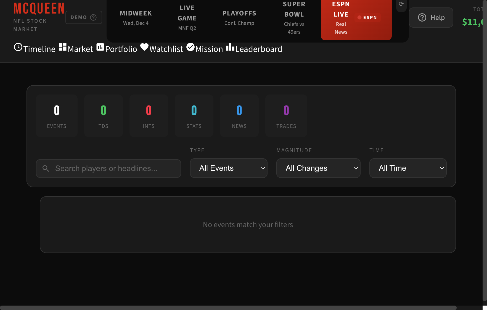
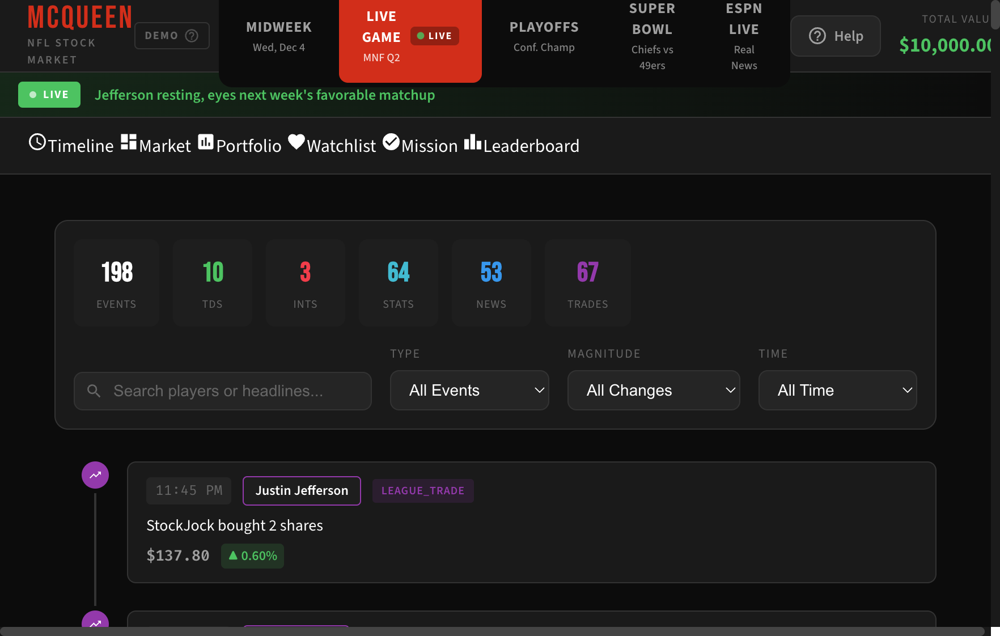
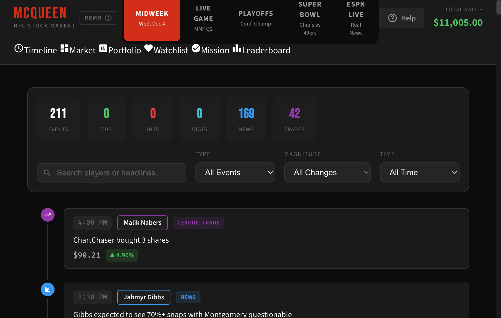
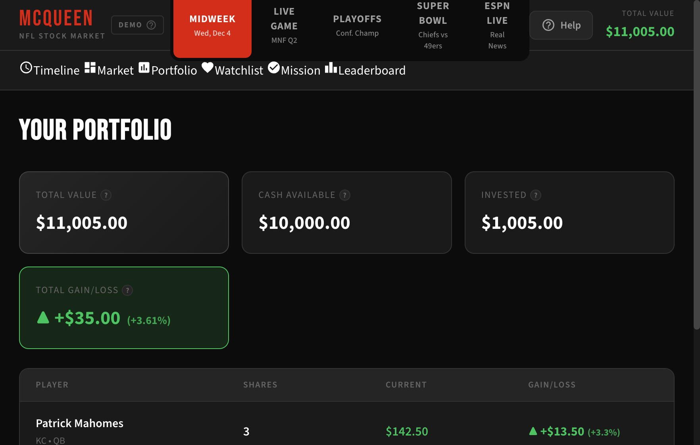
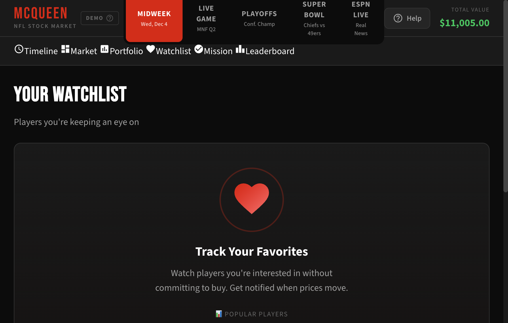
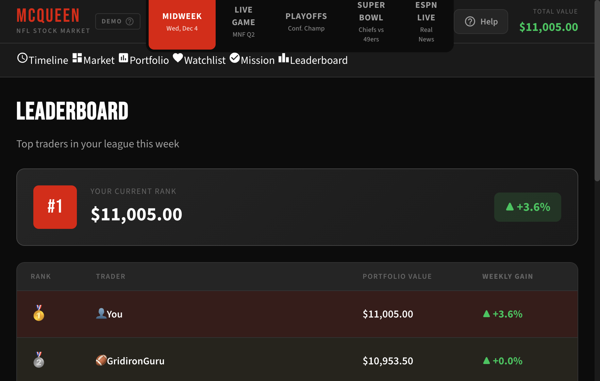
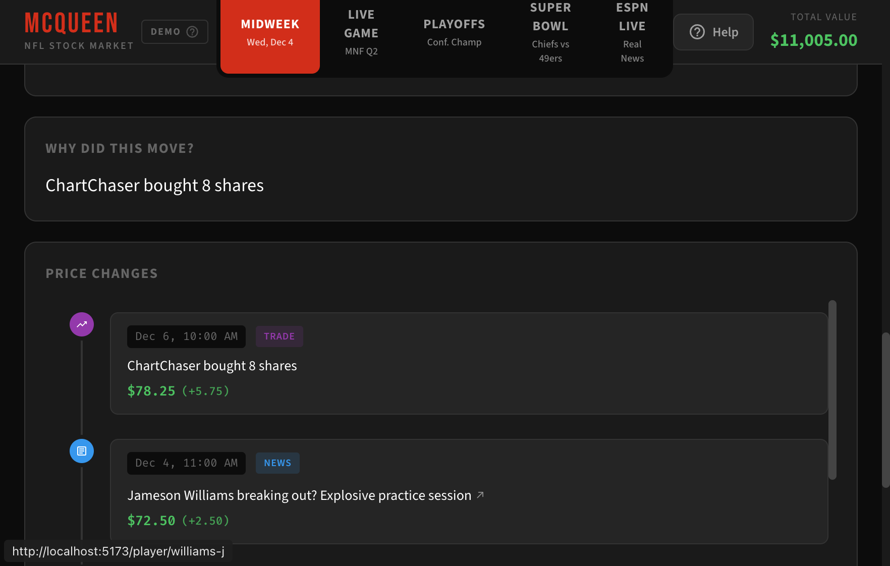
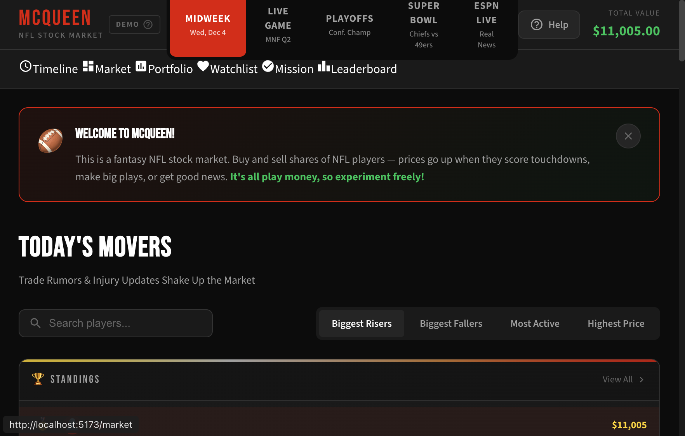

# Dogfood Report: McQueen NFL Stock Market

| Field | Value |
|-------|-------|
| **Date** | 2026-02-24 |
| **App URL** | http://localhost:5173/ |
| **Session** | localhost-5173 |
| **Scope** | Full app |

## Summary

| Severity | Count |
|----------|-------|
| Critical | 0 |
| High | 1 |
| Medium | 2 |
| Low | 3 |
| **Total** | **6** |

## Issues

### ISSUE-001: Total Value label and amount clipped at right edge of header

| Field | Value |
|-------|-------|
| **Severity** | medium |
| **Category** | visual |
| **URL** | http://localhost:5173/ |
| **Repro Video** | N/A |

**Description**

The "TOTAL VALUE" label and dollar amount in the top-right corner of the header are truncated by the viewport edge. The label shows "TO..." or "TOTAL VALU..." and the dollar amount shows "$11,0..." or "$10,000.0..." instead of the full text. This happens because the demo scenario tabs and other header elements consume too much horizontal space. The issue is most pronounced on the "ESPN Live" and "Live Game" scenarios, where extra badges (LIVE indicator, ESPN badge, refresh button) take up additional width.

On the Midweek scenario (which has no extra badges), the balance shows correctly as "$11,005.00".

**Repro Steps**

1. Navigate to http://localhost:5173/
   

2. Observe the top-right corner: "TO..." and "$11,0..." are clipped. Switch to Live Game tab.
   

3. Switch to Midweek tab — the balance now shows fully.
   

---

### ISSUE-002: All page content renders below the fold, initial viewport appears blank

| Field | Value |
|-------|-------|
| **Severity** | medium |
| **Category** | ux |
| **URL** | http://localhost:5173/ (all pages) |
| **Repro Video** | N/A |

**Description**

On every page in the app (Timeline, Portfolio, Watchlist, Mission, Leaderboard), the header area — consisting of the logo, demo scenario tabs, Help button, balance, and navigation bar — consumes approximately 120px of vertical space. This pushes all meaningful page content below the initial viewport. When a user navigates to any page, they first see what appears to be a completely blank/dark page and must scroll down to find the actual content.

This is especially confusing on pages like Portfolio, Watchlist, and Leaderboard where the initial viewport shows only dark empty space, giving the impression the page is broken or has no content.

**Repro Steps**

1. Navigate to http://localhost:5173/portfolio — the viewport shows an empty dark page.
   Full-page screenshot reveals content is below the fold:
   

2. Navigate to http://localhost:5173/watchlist — same blank appearance in viewport.
   Full-page shows the empty state with heart icon:
   

3. Navigate to http://localhost:5173/leaderboard — viewport shows empty dark boxes.
   Full-page reveals the leaderboard table:
   

---

### ISSUE-003: ESPN Live scenario shows no data, refresh button provides no feedback

| Field | Value |
|-------|-------|
| **Severity** | high |
| **Category** | functional |
| **URL** | http://localhost:5173/ (ESPN Live scenario) |
| **Repro Video** | N/A |

**Description**

The "ESPN Live" demo scenario, labeled "Real News" with an ESPN badge, shows zero data across all counters (Events: 0, TDs: 0, INTs: 0, Stats: 0, News: 0, Trades: 0) and displays "No events match your filters" on the Timeline page. This is the default scenario when the app first loads.

Clicking the "Refresh ESPN news" button (circular arrow icon next to the ESPN tab) disables the button briefly but produces no visible result — no data appears, no loading spinner, no success/error toast, and no console errors. The user has no way to know whether the refresh attempted and failed, or if the feature is simply not functional.

A new user landing on this app for the first time would see an empty timeline with all-zero stats as their first impression, which is particularly problematic since ESPN Live is the default selected scenario.

**Repro Steps**

1. Load http://localhost:5173/ — ESPN Live is the default selected scenario. All counters show 0, "No events match your filters" is displayed.
   

2. Click the refresh button (circular arrow) next to the ESPN Live tab. The button disables momentarily, then re-enables. No data loads, no error shown.
   

---

### ISSUE-004: Raw enum "LEAGUE_TRADE" displayed in timeline event tags

| Field | Value |
|-------|-------|
| **Severity** | low |
| **Category** | content |
| **URL** | http://localhost:5173/ (Timeline, Live Game scenario) |
| **Repro Video** | N/A |

**Description**

Timeline events display raw machine-readable tag text "LEAGUE_TRADE" instead of a human-friendly label like "Trade". While the filter dropdown correctly shows "Trades" as an option, the tag badges on individual timeline entries use the internal enum value with an underscore, which looks unpolished.

**Repro Steps**

1. Select the "Live Game" scenario tab, then scroll down on the Timeline page. Observe the "LEAGUE_TRADE" tag next to player names on trade events.
   

---

### ISSUE-005: Player detail shows future-dated event relative to scenario date

| Field | Value |
|-------|-------|
| **Severity** | low |
| **Category** | content |
| **URL** | http://localhost:5173/player/williams-j (Midweek scenario) |
| **Repro Video** | N/A |

**Description**

On the Midweek scenario (labeled "Wed, Dec 4"), the Jameson Williams player detail page shows a price change entry dated "Dec 6, 10:00 AM" — two days in the future relative to the scenario's date. This breaks the immersion of the demo scenario, as events should not occur after the scenario's current date.

**Repro Steps**

1. Select the "Midweek" scenario tab, navigate to Market, click on Jameson Williams, and scroll to the "PRICE CHANGES" section.
   

---

### ISSUE-006: Welcome banner uses debug-style dashed red border

| Field | Value |
|-------|-------|
| **Severity** | low |
| **Category** | visual |
| **URL** | http://localhost:5173/market |
| **Repro Video** | N/A |

**Description**

The "Welcome to McQueen!" banner at the top of the Market page has a prominent dashed red border that looks like a debug/development styling artifact rather than a polished UI element. The rest of the app uses solid, subtle borders — this dashed red border stands out as visually inconsistent and gives the impression of a leftover development aid.

**Repro Steps**

1. Navigate to http://localhost:5173/market. The welcome banner at the top has a red dashed border around it.
   

---
