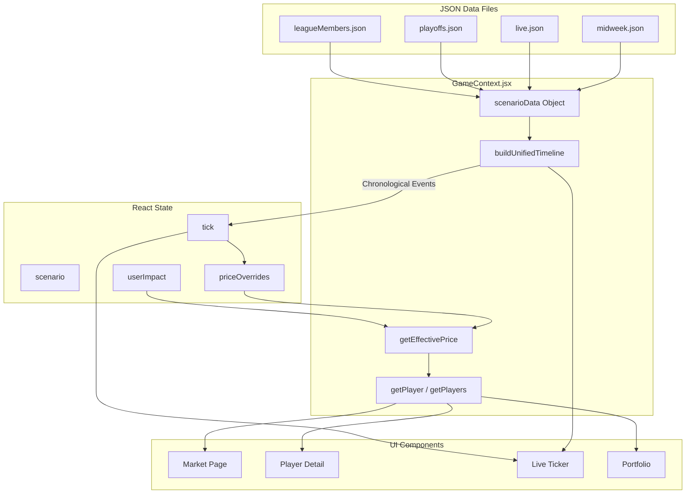

# McQueen JSON Data Documentation

This document explains the JSON data structures that power the McQueen NFL Stock Market game engine. Whether you're a developer extending the codebase or a content creator building new scenarios, this guide covers everything you need to know.

---

## Table of Contents

1. [Overview](#overview)
2. [File Structure](#file-structure)
3. [Scenario File Schema](#scenario-file-schema)
4. [Player Object Schema](#player-object-schema)
5. [Price History Schema](#price-history-schema)
6. [Content Tiles Schema](#content-tiles-schema)
7. [League Members Schema](#league-members-schema)
8. [Annotated Examples](#annotated-examples)
9. [Data Flow Diagram](#data-flow-diagram)
10. [How the Engine Processes Data](#how-the-engine-processes-data)

---

## Overview

The McQueen game engine simulates a stock market where NFL players are tradeable assets. Prices fluctuate based on:

- **Game events** (touchdowns, interceptions, big plays)
- **News** (injuries, trade rumors, analysis)
- **League trades** (other members buying/selling)
- **User trades** (your own buy/sell activity)

All scenario data lives in static JSON files that the game engine processes at runtime.

---

## File Structure

```
src/data/
├── README.md           # This documentation
├── midweek.json        # Non-game day scenario
├── live.json           # Live game simulation (MNF: Chiefs vs Bills)
├── playoffs.json       # Playoff scenario with buyback mechanics
└── leagueMembers.json  # AI league members and their holdings
```

| File | Purpose | Player Count |
|------|---------|--------------|
| `midweek.json` | Wednesday afternoon - prices move on news, injuries, trade rumors | 20 players |
| `live.json` | Monday Night Football - real-time game event simulation | 21 players |
| `playoffs.json` | Conference Championships - includes buyback mechanics for eliminated teams | 19 players |
| `leagueMembers.json` | Defines AI traders and their pre-populated portfolios | 10 members |

---

## Scenario File Schema

Each scenario file follows this root structure:

```json
{
  "scenario": "live",
  "timestamp": "2025-12-09T21:45:00",
  "headline": "Monday Night Football: Chiefs vs. Bills - Q2",
  "players": [...]
}
```

### Field Reference

| Field | Type | Required | Description |
|-------|------|----------|-------------|
| `scenario` | string | ✅ | Identifier: `"midweek"`, `"live"`, or `"playoffs"` |
| `timestamp` | string | ✅ | ISO-8601 datetime representing "now" in the scenario |
| `headline` | string | ✅ | Display headline shown in the UI header |
| `players` | array | ✅ | Array of player objects (see next section) |

---

## Player Object Schema

Each player in the `players` array represents a tradeable stock:

```json
{
  "id": "mahomes",
  "name": "Patrick Mahomes",
  "team": "KC",
  "position": "QB",
  "basePrice": 142.50,
  "totalSharesAvailable": 1000,
  "isActive": true,
  "isBuyback": false,
  "priceHistory": [...]
}
```

### Field Reference

| Field | Type | Required | Description |
|-------|------|----------|-------------|
| `id` | string | ✅ | Unique identifier used for lookups (lowercase, hyphenated) |
| `name` | string | ✅ | Display name |
| `team` | string | ✅ | Team abbreviation (e.g., `"KC"`, `"BUF"`, `"SF"`) |
| `position` | string | ✅ | Position: `"QB"`, `"RB"`, `"WR"`, or `"TE"` |
| `basePrice` | number | ✅ | Starting price at scenario start (used for % change calculation) |
| `totalSharesAvailable` | number | ✅ | Total shares in circulation (typically 1000) |
| `isActive` | boolean | ✅ | `true` if player is currently in a live game |
| `isBuyback` | boolean | ❌ | `true` if player's team is eliminated (playoffs only) |
| `priceHistory` | array | ✅ | Timeline of price-changing events |

### Notes on Fields

- **`id`**: Must be unique across all scenarios. Use lowercase with hyphens for multi-word IDs (e.g., `"diggs-s"` for Stefon Diggs to distinguish from other Diggs players).

- **`isActive`**: Controls UI indicators. In `live.json`, active players show a "LIVE" badge and their events appear in the ticker.

- **`isBuyback`**: Only used in `playoffs.json`. When `true`, the player's stock enters forced buyback mode (price crashes, shares are repurchased at a discount).

---

## Price History Schema

The `priceHistory` array is the heart of the simulation. Each entry represents a price-moving event in chronological order.

```json
{
  "timestamp": "2025-12-09T21:20:00",
  "price": 153.97,
  "reason": {
    "type": "game_event",
    "eventType": "TD",
    "headline": "TOUCHDOWN! Mahomes finds Kelce for 22-yard score",
    "source": "ESPN Gamecast",
    "url": "https://www.espn.com/nfl/game/_/gameId/401547417"
  },
  "content": [
    { "type": "video", "title": "LIVE: Mahomes TD to Kelce", "source": "ESPN Gamecast", "url": "#" },
    { "type": "analysis", "title": "Mahomes Carving Up Bills D", "source": "NFL Live", "url": "#" }
  ]
}
```

### Field Reference

| Field | Type | Required | Description |
|-------|------|----------|-------------|
| `timestamp` | string | ✅ | ISO-8601 datetime when this event occurred |
| `price` | number | ✅ | New stock price after this event |
| `reason` | object | ✅ | Object describing what caused the price move |
| `content` | array | ❌ | Optional media tiles to display (videos, articles) |

### Reason Object Schema

The `reason` object varies based on `type`:

#### Type: `"news"`

General news, injury reports, analysis pieces.

```json
{
  "type": "news",
  "headline": "Hill limited in practice with hamstring tightness",
  "source": "ESPN NFL",
  "url": "https://www.espn.com/nfl/story/_/id/12346/tyreek-hill-hamstring-practice"
}
```

| Field | Type | Required | Description |
|-------|------|----------|-------------|
| `type` | string | ✅ | `"news"` |
| `headline` | string | ✅ | Short description displayed in UI |
| `source` | string | ✅ | Attribution (e.g., "ESPN NFL", "Fantasy Focus") |
| `url` | string | ❌ | Link to full article |

#### Type: `"game_event"`

In-game events during live simulations.

```json
{
  "type": "game_event",
  "eventType": "TD",
  "headline": "TOUCHDOWN! Pacheco punches it in from 3 yards out",
  "source": "ESPN Gamecast",
  "url": "https://www.espn.com/nfl/game/_/gameId/401547417"
}
```

| Field | Type | Required | Description |
|-------|------|----------|-------------|
| `type` | string | ✅ | `"game_event"` |
| `eventType` | string | ✅ | Event category: `"TD"`, `"INT"`, `"stats"` |
| `headline` | string | ✅ | Play-by-play description |
| `source` | string | ✅ | Typically "ESPN Gamecast" |
| `url` | string | ❌ | Link to game page |

**Event Types:**
- `"TD"` - Touchdown (causes significant price increase)
- `"INT"` - Interception (causes price decrease)
- `"stats"` - General stat accumulation (moderate price change)

#### Type: `"league_trade"`

When AI league members buy or sell shares.

```json
{
  "type": "league_trade",
  "headline": "GridironGuru bought 5 shares",
  "source": "McQueen Market",
  "memberId": "gridiron",
  "action": "buy",
  "shares": 5
}
```

| Field | Type | Required | Description |
|-------|------|----------|-------------|
| `type` | string | ✅ | `"league_trade"` |
| `headline` | string | ✅ | Human-readable description |
| `source` | string | ✅ | Always `"McQueen Market"` |
| `memberId` | string | ✅ | ID of the trading member (from `leagueMembers.json`) |
| `action` | string | ✅ | `"buy"` or `"sell"` |
| `shares` | number | ✅ | Number of shares traded |

---

## Content Tiles Schema

The optional `content` array attaches media to price events. These appear as clickable tiles on player detail pages.

```json
{
  "type": "video",
  "title": "LIVE: Mahomes TD to Kelce",
  "source": "ESPN Gamecast",
  "url": "#"
}
```

### Field Reference

| Field | Type | Required | Description |
|-------|------|----------|-------------|
| `type` | string | ✅ | `"video"`, `"article"`, `"news"`, or `"analysis"` |
| `title` | string | ✅ | Tile headline |
| `source` | string | ✅ | Attribution |
| `url` | string | ✅ | Link destination (use `"#"` for placeholder) |

### Content Types

| Type | Icon | Use Case |
|------|------|----------|
| `video` | 🎬 | Game highlights, press conferences |
| `article` | 📰 | Long-form analysis pieces |
| `news` | 📢 | Breaking news, injury updates |
| `analysis` | 📊 | Fantasy analysis, stat breakdowns |

---

## League Members Schema

The `leagueMembers.json` file defines AI traders and their portfolios.

```json
{
  "members": [
    { "id": "user", "name": "You", "isUser": true },
    { "id": "gridiron", "name": "GridironGuru", "avatar": "🏈" },
    { "id": "tdking", "name": "TDKing2024", "avatar": "👑" }
  ],
  "holdings": {
    "mahomes": [
      { "memberId": "gridiron", "shares": 15, "avgCost": 135.00 },
      { "memberId": "tdking", "shares": 8, "avgCost": 140.25 }
    ]
  }
}
```

### Members Array

| Field | Type | Required | Description |
|-------|------|----------|-------------|
| `id` | string | ✅ | Unique identifier (matches `memberId` in trades) |
| `name` | string | ✅ | Display name |
| `avatar` | string | ❌ | Emoji avatar |
| `isUser` | boolean | ❌ | `true` for the human player |

### Holdings Object

Maps player IDs to arrays of member holdings:

| Field | Type | Description |
|-------|------|-------------|
| `memberId` | string | Member's ID |
| `shares` | number | Number of shares owned |
| `avgCost` | number | Average cost basis per share |

---

## Annotated Examples

### Example 1: Touchdown Event (Price Spike)

From `live.json` - Mahomes throws a TD to Kelce:

```json
{
  "timestamp": "2025-12-09T21:20:00",
  "price": 153.97,                          // Price jumped from 150.22
  "reason": {
    "type": "game_event",
    "eventType": "TD",                      // Touchdown = big price move
    "headline": "TOUCHDOWN! Mahomes finds Kelce for 22-yard score",
    "source": "ESPN Gamecast",
    "url": "https://www.espn.com/nfl/game/_/gameId/401547417"
  },
  "content": [
    { "type": "video", "title": "LIVE: Mahomes TD to Kelce", "source": "ESPN Gamecast", "url": "#" },
    { "type": "analysis", "title": "Mahomes Carving Up Bills D", "source": "NFL Live", "url": "#" }
  ]
}
```

**Price Impact:** +$3.75 (+2.5%) - TDs cause significant spikes.

---

### Example 2: Injury News (Price Drop)

From `midweek.json` - Tyreek Hill's hamstring issue:

```json
{
  "timestamp": "2025-12-04T10:30:00",
  "price": 120.50,                          // Down from 122.00 base
  "reason": {
    "type": "news",
    "headline": "Hill limited in practice with hamstring tightness",
    "source": "ESPN NFL",
    "url": "https://www.espn.com/nfl/story/_/id/12346/tyreek-hill-hamstring-practice"
  },
  "content": [
    { "type": "news", "title": "Hill Limited in Wednesday Practice", "source": "ESPN NFL", "url": "#" }
  ]
}
```

**Price Impact:** -$1.50 (-1.2%) - Injury uncertainty causes selloff.

---

### Example 3: League Trade (Social Proof)

From `live.json` - GridironGuru buys Mahomes:

```json
{
  "timestamp": "2025-12-09T20:22:00",
  "price": 144.36,                          // Up from 143.64
  "reason": {
    "type": "league_trade",
    "headline": "GridironGuru bought 5 shares",
    "source": "McQueen Market",
    "memberId": "gridiron",                 // Links to leagueMembers.json
    "action": "buy",
    "shares": 5
  }
}
```

**Price Impact:** +$0.72 (+0.5%) - League buys create upward pressure.

---

### Example 4: Buyback Crash (Playoff Elimination)

From `playoffs.json` - Stefon Diggs after Texans elimination:

```json
{
  "id": "diggs-s",
  "name": "Stefon Diggs",
  "team": "HOU",
  "position": "WR",
  "basePrice": 85.00,
  "isBuyback": true,                        // Elimination flag
  "priceHistory": [
    {
      "timestamp": "2026-01-13T18:00:00",
      "price": 72.50,                       // Immediate 15% drop
      "reason": {
        "type": "news",
        "headline": "TEXANS ELIMINATED - Chiefs end Houston's season",
        "source": "ESPN NFL"
      }
    },
    {
      "timestamp": "2026-01-16T09:00:00",
      "price": 45.00,                       // Crashed to buyback price
      "reason": {
        "type": "news",
        "headline": "BUYBACK ACTIVE - Diggs shares being bought back at $45",
        "source": "McQueen Market"
      }
    }
  ]
}
```

**Price Impact:** -$40 (-47%) - Elimination triggers forced buyback at discount.

---

## Data Flow Diagram



### Data Flow Steps

1. **Scenario Selection** → User picks midweek/live/playoffs
2. **JSON Loading** → `scenarioData` object maps scenario names to imported JSON
3. **Timeline Building** → `buildUnifiedTimeline()` merges all players' `priceHistory` arrays into one chronological list
4. **Tick Simulation** → In live mode, a 3-second interval advances through the timeline
5. **Price Calculation** → `getEffectivePrice()` returns current price + user impact
6. **UI Consumption** → Components call `getPlayers()` or `getPlayer(id)` via the `useGame()` hook

---

## How the Engine Processes Data

The game engine in `src/context/GameContext.jsx` transforms static JSON into a dynamic simulation.

### Key Functions

#### `getCurrentPriceFromHistory(player)`

Returns the most recent price from a player's `priceHistory`, or `basePrice` if no history exists.

```javascript
function getCurrentPriceFromHistory(player) {
  if (!player) return 0;
  const history = player.priceHistory;
  if (history && history.length > 0) {
    return history[history.length - 1].price;
  }
  return player.basePrice;
}
```

#### `buildUnifiedTimeline(players)`

Merges all players' price histories into a single chronological timeline for live simulation:

```javascript
function buildUnifiedTimeline(players) {
  const timeline = [];
  
  players.forEach(player => {
    if (player.priceHistory) {
      player.priceHistory.forEach((entry, index) => {
        timeline.push({
          playerId: player.id,
          playerName: player.name,
          timestamp: entry.timestamp,
          price: entry.price,
          reason: entry.reason,
          content: entry.content,
        });
      });
    }
  });
  
  // Sort chronologically
  timeline.sort((a, b) => new Date(a.timestamp) - new Date(b.timestamp));
  
  return timeline;
}
```

#### `getEffectivePrice(playerId)`

Calculates the current price including user trade impact:

```javascript
const getEffectivePrice = useCallback((playerId) => {
  const player = players.find(p => p.id === playerId);
  
  // Start with price from history or override
  let basePrice = priceOverrides[playerId] ?? getCurrentPriceFromHistory(player);
  
  // Apply user impact (each share moves price by 0.1%)
  const impact = userImpact[playerId] || 0;
  return +(basePrice * (1 + impact)).toFixed(2);
}, [players, priceOverrides, userImpact]);
```

#### Live Simulation Loop

In live mode, a `setInterval` advances through the unified timeline every 3 seconds:

```javascript
useEffect(() => {
  if (scenario === 'live' && isPlaying) {
    tickIntervalRef.current = setInterval(() => {
      setTick((prevTick) => {
        const nextTick = prevTick + 1;
        if (nextTick >= unifiedTimeline.length) {
          setIsPlaying(false);
          return prevTick;
        }
        
        // Apply the timeline entry's price
        const entry = unifiedTimeline[nextTick];
        setPriceOverrides(prev => ({
          ...prev,
          [entry.playerId]: entry.price
        }));
        
        return nextTick;
      });
    }, 3000);
  }
}, [scenario, isPlaying, unifiedTimeline]);
```

### Constants

```javascript
const INITIAL_CASH = 10000;           // Starting cash for user
const USER_IMPACT_FACTOR = 0.001;     // Each share moves price by 0.1%
```

---

## Creating New Scenarios

To create a new scenario:

1. **Create the JSON file** in `src/data/` (e.g., `superbowl.json`)

2. **Follow the schema** with required fields:
   ```json
   {
     "scenario": "superbowl",
     "timestamp": "2026-02-09T18:30:00",
     "headline": "Super Bowl LX - Chiefs vs Lions",
     "players": [...]
   }
   ```

3. **Add price history entries** in chronological order for each player

4. **Import in GameContext.jsx**:
   ```javascript
   import superbowlData from '../data/superbowl.json';
   
   const scenarioData = {
     midweek: midweekData,
     live: liveData,
     playoffs: playoffsData,
     superbowl: superbowlData,  // Add here
   };
   ```

5. **Add scenario toggle** in `ScenarioToggle.jsx`

---

## Tips for Content Creators

1. **Price movements should be realistic** - TDs cause 2-5% spikes, injuries cause 1-3% drops

2. **Space out timestamps** - Events should be minutes apart for live simulation pacing

3. **Include variety** - Mix game events, news, and league trades for engagement

4. **Add content tiles for big moments** - TDs and major news deserve video/article tiles

5. **Test the timeline** - Use the Timeline Debugger to verify events play in correct order

---

## Questions?

Check the main [README.md](../../README.md) for app features and getting started, or explore the [GameContext.jsx](../context/GameContext.jsx) source code for implementation details.

